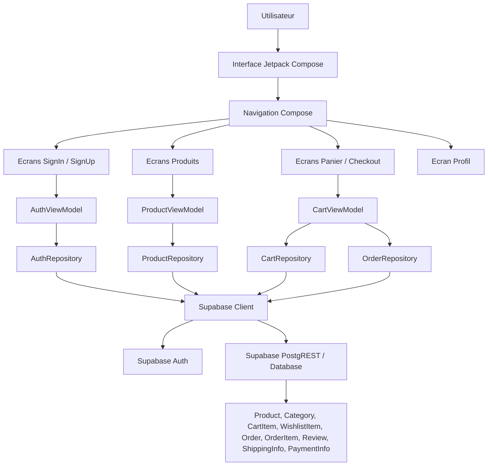
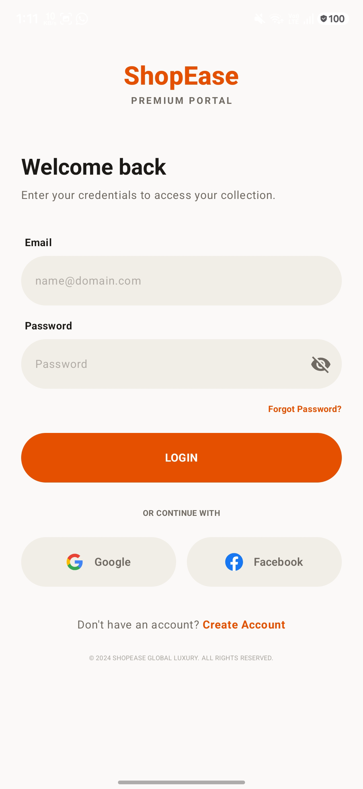
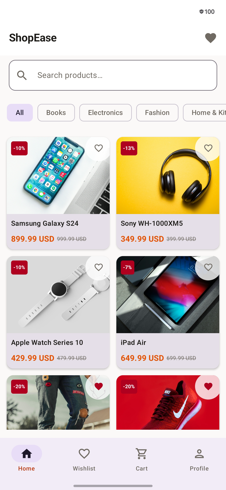
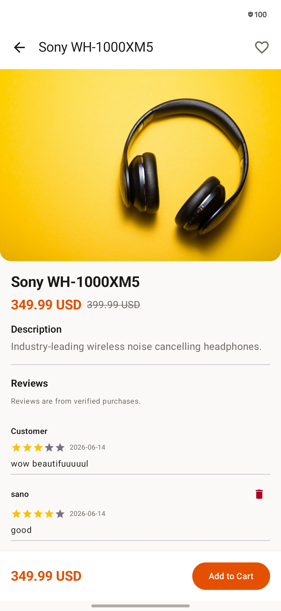
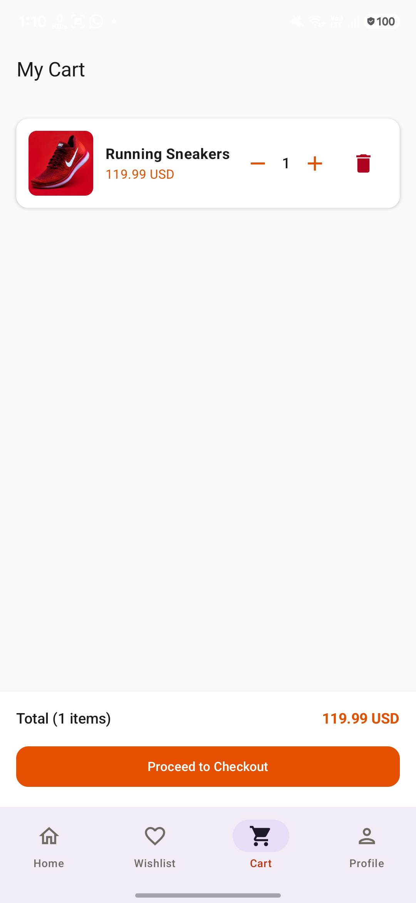
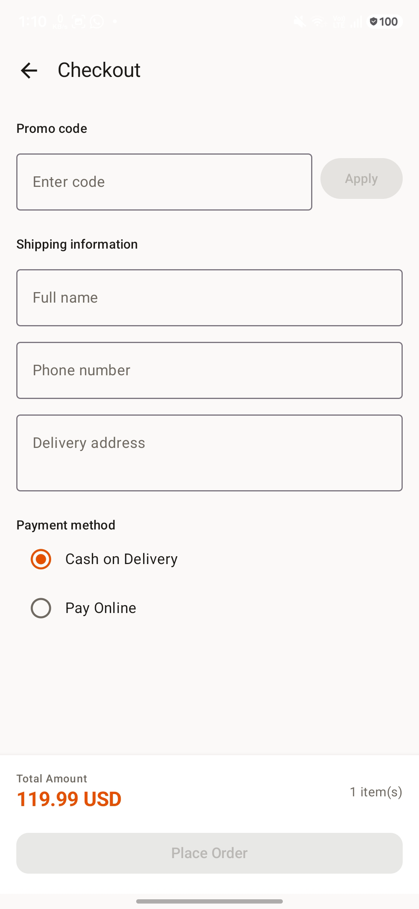
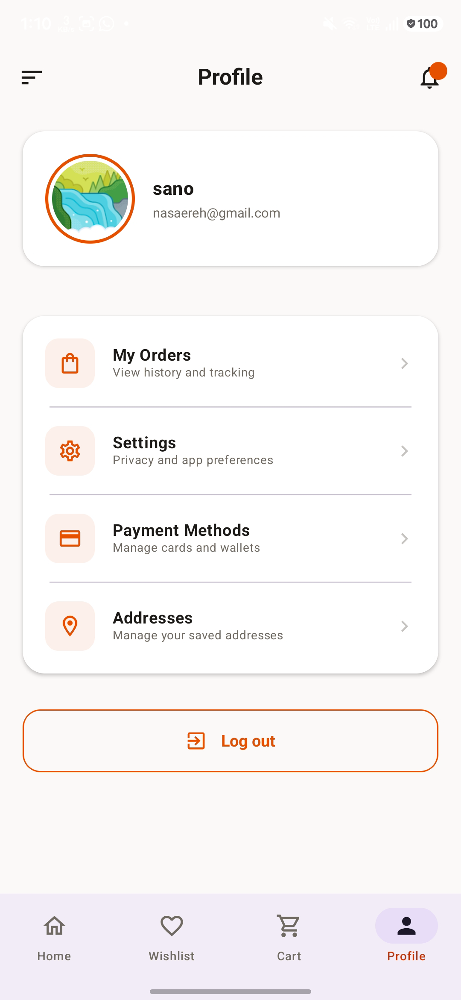

# ShopEase

ShopEase est une application mobile Android de commerce en ligne développée avec Kotlin, Jetpack Compose et Supabase. Elle permet aux utilisateurs de s'inscrire, de se connecter, de consulter un catalogue de produits, de gérer un panier, d'ajouter des produits aux favoris et de passer une commande.

## Membres de l'équipe

- HAJAR EL BACHIRI
- KHALID LAZRAG

## Dépendances et configuration

Le projet utilise Gradle pour télécharger automatiquement les dépendances Android et Kotlin.

Dépendances principales :

- Kotlin 2.2.10
- Android Gradle Plugin 8.13.0
- Jetpack Compose avec Compose BOM 2026.02.01
- Material 3
- Navigation Compose 2.8.0
- Supabase Kotlin 2.6.1 pour l'authentification et la base de données
- Ktor Android 2.3.12
- Coil Compose 2.6.0 pour le chargement des images
- AndroidX Core, Lifecycle et Activity Compose

Configuration requise :

- Android Studio récent
- JDK 11 ou plus
- SDK Android avec `compileSdk` 36
- Un projet Supabase avec les tables nécessaires à l'application

Avant de lancer l'application, ajouter les variables suivantes dans le fichier `local.properties` à la racine du projet :

```properties
SUPABASE_URL=https://votre-projet.supabase.co
SUPABASE_ANON_KEY=votre_cle_anon_supabase
```

## Description du projet

ShopEase est organisé autour d'une expérience e-commerce classique. L'utilisateur commence par s'authentifier, puis accède au catalogue de produits. Il peut ouvrir le détail d'un produit, ajouter des articles au panier ou à la wishlist, consulter son panier, valider une commande et gérer son profil.

Fonctionnalités principales :

- Inscription et connexion utilisateur avec Supabase Auth
- Authentification sociale via Google et Facebook
- Liste des produits
- Détail d'un produit
- Gestion de la wishlist
- Gestion du panier
- Checkout et création de commande
- Profil utilisateur et déconnexion
- Chargement des données depuis Supabase PostgREST
- Interface déclarative avec Jetpack Compose

## Schéma d'architecture



## Captures de l'application













## Lancement du projet

1. Ouvrir le projet dans Android Studio.
2. Vérifier que `local.properties` contient `SUPABASE_URL` et `SUPABASE_ANON_KEY`.
3. Synchroniser Gradle.
4. Lancer l'application sur un émulateur ou un appareil Android.
